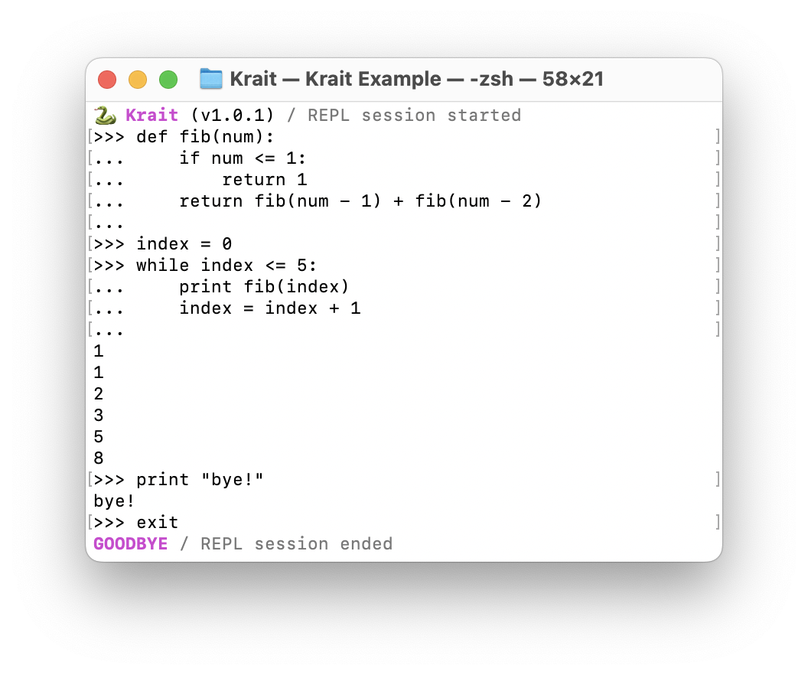

# 🐍 Krait

Krait (inspired by Python シ) is an interpreted, dynamically-typed language implemented in C++.

### Project Structure

```text
Krait/
├── src/
│   ├── core/          # Built-in object types (Integer, String, Boolean, etc.), Garbage Collector
│   ├── semantics/     # Executable semantics (Variable, Assign, If, While, etc.
│   ├── lexer/         # Split the source code into tokens.
│   ├── parser/        # Parsing the tokens to create the AST's
│   ├── interpreter/   # The interpreter for executing the AST's
│   ├── runtime/       # The state of the program at runtime
│   ├── exceptions/    # Built-in exception classes
│   └── utils/         # Utilities
├── run/               # The tokenize-parse-interpret flow
└── tests/             # Tests
```

### Getting Started
```bash
git clone https://github.com/arielverbin/Krait.git
cd krait
make test    # For running all tests/*/tests.cpp
make release # For compiling the release version of Krait
make debug   # For compiling the debug version of Krait
```
You can also use `./build/release/krait path/to/file.kr` to run scripts.

### Read-Evaluate-Print-Loop (RELP)
By running `./build/release/krait` without arguments, a REPL shell will open. Use `exit` to terminate.

<p align="center">
  
</p>

## TODO
- [x] Member lookup (`obj.field`)
- [x] Automatic type casting, `__radd__`, `__rmul__` mechanism
- [ ] `list` datatype, `list[index]` operator
- [ ] `for` loops, iterables
- [x] Support for user-defined types (classes)
- [x] Support for decorators (`@`)
- [x] Garbage Collector
- [ ] Common modules like `sys` and `os`
- [ ] Support for writing native C/C++ modules
